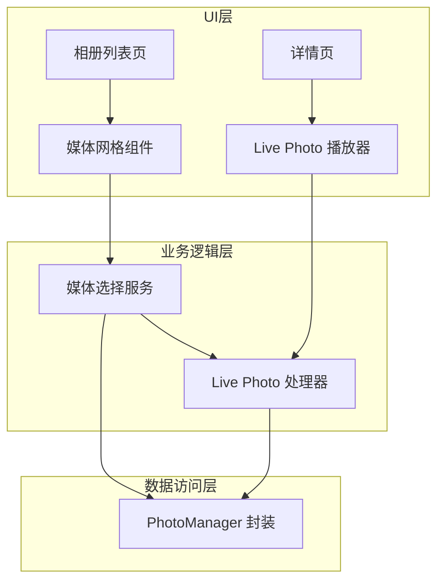

## 产品概述

使用 photo_manager 包重构现有媒体选择功能，实现 iOS Live Photo（实况照片）的完整支持，包括导入和播放功能。在照片详情页自动播放实况照片的视频部分，提供沉浸式的查看体验。

## 核心功能

- **媒体选择重构**：使用 photo_manager 包替换现有媒体选择逻辑，支持获取设备相册中的所有媒体资源
- **Live Photo 识别与导入**：自动识别 iOS 设备中的实况照片，同时获取静态图片和视频部分
- **相册列表展示**：在相册列表中仅显示实况照片的静态图片缩略图，保持界面简洁
- **详情页自动播放**：进入照片详情页时，自动播放实况照片的视频部分，无需用户手动触发
- **播放控制**：支持实况照片视频的循环播放或单次播放，退出详情页时自动停止

## 技术栈

- **框架**：Flutter (Dart)
- **媒体管理**：photo_manager 包
- **视频播放**：video_player 或 better_player
- **状态管理**：复用项目现有状态管理方案

## 技术架构

### 系统架构

采用分层架构，将媒体访问、业务逻辑和 UI 展示分离，确保代码可维护性。



### 模块划分

- **PhotoManager 封装模块**
- 职责：封装 photo_manager 包的 API 调用
- 关键技术：photo_manager
- 接口：获取相册列表、获取媒体资源、获取 Live Photo 视频文件

- **媒体选择服务模块**
- 职责：处理媒体选择业务逻辑，识别 Live Photo 类型
- 依赖：PhotoManager 封装模块
- 接口：选择媒体、获取缩略图、判断是否为 Live Photo

- **Live Photo 播放器模块**
- 职责：在详情页播放 Live Photo 的视频部分
- 关键技术：video_player
- 接口：自动播放、停止播放、播放状态管理

### 数据流


## 实现细节

### 核心目录结构

基于现有项目结构，新增/修改以下文件：

```
lib/
├── services/
│   └── media_service.dart          # 新增：媒体服务，封装 photo_manager
├── models/
│   └── live_photo_model.dart       # 新增：Live Photo 数据模型
├── widgets/
│   └── live_photo_player.dart      # 新增：Live Photo 播放组件
└── pages/
    ├── media_picker_page.dart      # 修改：重构媒体选择页面
    └── photo_detail_page.dart      # 修改：添加自动播放逻辑
```

### 关键代码结构

**LivePhotoModel 数据模型**：表示一个实况照片实体，包含静态图片资源和关联的视频文件路径。

```
class LivePhotoModel {
  final AssetEntity imageAsset;
  final String? videoPath;
  final bool isLivePhoto;
  
  LivePhotoModel({
    required this.imageAsset,
    this.videoPath,
    required this.isLivePhoto,
  });
}
```

**MediaService 服务类**：提供媒体资源的获取和 Live Photo 识别功能，封装 photo_manager 的底层调用。

```
class MediaService {
  Future<List<AssetEntity>> getMediaAssets();
  Future<bool> isLivePhoto(AssetEntity asset);
  Future<File?> getLivePhotoVideo(AssetEntity asset);
  Future<Uint8List?> getThumbnail(AssetEntity asset);
}
```

### 技术实现方案

**Live Photo 识别与获取**

1. 使用 photo_manager 的 `AssetEntity.type` 判断媒体类型
2. 对于 iOS 平台，检查 `subtype` 是否包含 Live Photo 标识
3. 使用 `AssetEntity.originFileWithSubtype` 获取 Live Photo 的视频部分

**详情页自动播放**

1. 进入详情页时检测是否为 Live Photo
2. 异步加载视频文件到本地缓存
3. 使用 VideoPlayerController 初始化并自动播放
4. 页面销毁时释放播放器资源

## 技术考量

### 性能优化

- 使用缩略图加载列表，避免加载原图
- Live Photo 视频按需加载，不预加载所有视频
- 实现视频文件缓存，避免重复获取

### 权限处理

- iOS 需要 `NSPhotoLibraryUsageDescription` 权限声明
- 运行时请求相册访问权限，处理权限拒绝情况

## Agent Extensions

### SubAgent

- **code-explorer**
- 用途：探索现有项目结构，了解当前媒体选择功能的实现方式，找到需要重构的代码位置
- 预期结果：获取现有媒体选择相关代码的完整结构和依赖关系，为重构提供基础