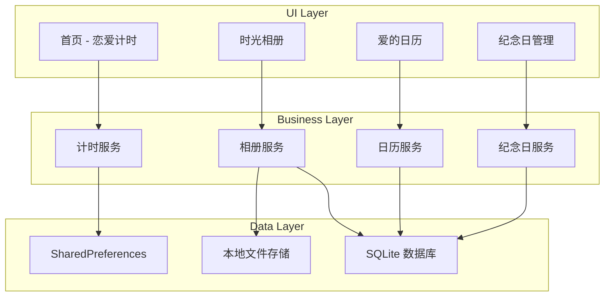

## 产品概述

LoveSpace 是一款专为情侣设计的纯本地存储记录应用，采用 Flutter 跨平台框架开发，优先支持 iOS 平台。应用以粉色浪漫为主题风格，帮助情侣记录和珍藏恋爱中的美好时光，所有数据均存储在本地，保护用户隐私。

## 核心功能

### 恋爱计时

- 设置恋爱开始日期，实时显示在一起的天数
- 支持自定义情侣头像和昵称
- 首页醒目展示恋爱时长，营造浪漫氛围

### 时光相册

- 瀑布流布局展示情侣照片
- 支持从相册导入照片并添加文字描述
- 按时间线浏览珍贵回忆
- 照片详情页支持查看大图和编辑描述

### 爱的日历

- 日历视图标记重要日期和事件
- 支持添加约会计划、特殊日子备注
- 直观查看每月的甜蜜记录

### 纪念日管理

- 创建和管理各类纪念日（相识、表白、结婚等）
- 自动计算距离下一个纪念日的天数
- 纪念日提醒功能
- 支持自定义纪念日类型和图标

## 技术选型

- **开发框架**: Flutter 3.x + Dart
- **目标平台**: iOS（优先）、Android（兼容）
- **本地存储**: SQLite (sqflite) + SharedPreferences
- **图片管理**: image_picker + cached_network_image
- **状态管理**: Provider / Riverpod
- **日期处理**: intl + table_calendar

## 技术架构

### 系统架构

采用分层架构模式，清晰分离 UI 层、业务逻辑层和数据层，确保代码可维护性和可扩展性。



### 模块划分

| 模块 | 职责 | 关键技术 | 依赖 |
| --- | --- | --- | --- |
| Core | 基础配置、主题、路由 | Flutter Navigator 2.0 | 无 |
| Home | 恋爱计时展示、情侣信息 | Provider | Core, Data |
| Album | 瀑布流相册、照片管理 | flutter_staggered_grid_view, image_picker | Core, Data |
| Calendar | 日历视图、事件管理 | table_calendar | Core, Data |
| Anniversary | 纪念日 CRUD、倒计时 | Provider | Core, Data |
| Data | 数据持久化、模型定义 | sqflite, shared_preferences | 无 |


### 数据流


## 实现细节

### 核心目录结构

```
love_space/
├── lib/
│   ├── main.dart                 # 应用入口
│   ├── app.dart                  # App 配置
│   ├── core/
│   │   ├── theme/                # 粉色浪漫主题配置
│   │   ├── routes/               # 路由配置
│   │   └── constants/            # 常量定义
│   ├── models/
│   │   ├── couple_info.dart      # 情侣信息模型
│   │   ├── photo.dart            # 照片模型
│   │   ├── calendar_event.dart   # 日历事件模型
│   │   └── anniversary.dart      # 纪念日模型
│   ├── services/
│   │   ├── database_service.dart # 数据库服务
│   │   ├── storage_service.dart  # 本地存储服务
│   │   └── image_service.dart    # 图片处理服务
│   ├── providers/
│   │   ├── couple_provider.dart  # 情侣信息状态
│   │   ├── album_provider.dart   # 相册状态
│   │   ├── calendar_provider.dart# 日历状态
│   │   └── anniversary_provider.dart # 纪念日状态
│   ├── screens/
│   │   ├── home/                 # 首页-恋爱计时
│   │   ├── album/                # 时光相册
│   │   ├── calendar/             # 爱的日历
│   │   └── anniversary/          # 纪念日管理
│   └── widgets/
│       ├── common/               # 通用组件
│       └── custom/               # 自定义组件
├── assets/
│   ├── images/                   # 图片资源
│   └── fonts/                    # 字体文件
├── ios/                          # iOS 平台配置
├── android/                      # Android 平台配置
└── pubspec.yaml                  # 依赖配置
```

### 关键数据结构

**情侣信息模型**: 存储情侣基本信息和恋爱开始日期

```
class CoupleInfo {
  final String? partnerOneName;
  final String? partnerTwoName;
  final String? partnerOneAvatar;
  final String? partnerTwoAvatar;
  final DateTime startDate;
  
  int get daysTogether => DateTime.now().difference(startDate).inDays;
}
```

**照片模型**: 管理相册中的照片数据

```
class Photo {
  final String id;
  final String localPath;
  final String? description;
  final DateTime createdAt;
  final DateTime? takenAt;
}
```

**纪念日模型**: 定义纪念日的数据结构

```
class Anniversary {
  final String id;
  final String title;
  final DateTime date;
  final AnniversaryType type;
  final bool isRecurring;
  final String? iconName;
  
  int get daysUntil => date.difference(DateTime.now()).inDays;
}
```

### 技术实现要点

1. **本地数据库设计**

- 使用 sqflite 创建 photos、calendar_events、anniversaries 三张核心表
- SharedPreferences 存储情侣基本信息和应用设置

2. **瀑布流相册实现**

- 采用 flutter_staggered_grid_view 实现不规则瀑布流布局
- 图片懒加载和缓存优化性能

3. **日历组件集成**

- 使用 table_calendar 实现日历视图
- 自定义日期标记样式匹配粉色主题

4. **iOS 平台适配**

- 遵循 iOS Human Interface Guidelines
- 适配 Safe Area 和不同屏幕尺寸

## 设计风格

采用浪漫粉色主题，营造温馨甜蜜的视觉氛围。整体设计风格简约优雅，以柔和的粉色渐变为主色调，搭配圆润的卡片设计和细腻的阴影效果，打造专属情侣的私密空间感。

## 页面规划

### 首页 - 恋爱计时

- **顶部区域**: 双头像展示区，两个圆形头像并排显示，中间用爱心图标连接
- **计时展示区**: 大字体醒目显示在一起的天数，配合浪漫的背景渐变
- **情侣昵称**: 显示双方昵称，支持点击编辑
- **快捷入口**: 四宫格卡片展示四大功能模块入口

### 时光相册

- **顶部导航**: 标题 + 添加照片按钮
- **瀑布流区域**: 不规则双列瀑布流布局，照片卡片带圆角和轻微阴影
- **照片卡片**: 显示照片缩略图，底部叠加半透明渐变显示日期
- **空状态**: 浪漫插画引导用户添加第一张照片

### 爱的日历

- **月份切换**: 左右箭头切换月份，中间显示当前年月
- **日历网格**: 标准日历布局，有事件的日期用粉色圆点标记
- **事件列表**: 日历下方显示选中日期的事件列表
- **添加按钮**: 悬浮按钮添加新事件

### 纪念日管理

- **纪念日卡片列表**: 垂直滚动的卡片列表
- **卡片设计**: 左侧图标 + 中间标题日期 + 右侧倒计时天数
- **分类标签**: 顶部横向滚动的分类筛选标签
- **添加入口**: 底部固定添加纪念日按钮

### 底部导航栏

- 四个 Tab: 首页、相册、日历、纪念日
- 选中状态使用主题粉色高亮
- 图标配合文字标签